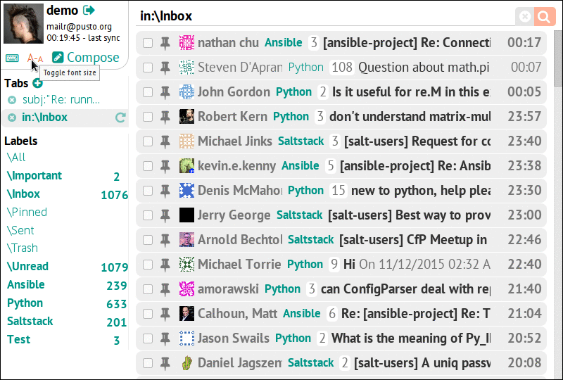

# The alpha is here

**[public demo][demo] :: [github page][gh] :: [short video][video] :: [reddit discussion][reddit] :: [donate][]**

[info]: https://pusto.org/mailur/
[gh]: https://github.com/naspeh/mailur/
[demo]: http://mail.pusto.org
[video]: https://vimeo.com/145416826
[reddit]: https://www.reddit.com/r/linux/comments/3t07mv/
[donate]: https://www.patreon.com/naspeh?ty=h

Mailur aims to become the future open source replacement for Gmail.

It is already usable as an alternative Gmail interface with a set of unique features:
- internal lightweight tabs
- linking few threads together
- composing emails with [Markdown][]

[Markdown]: https://daringfireball.net/projects/markdown/syntax

Mailur has got many changes since [the first intro][intro], but main points are still the same. It has been developed with simplicity in mind. It should be simple to use, to develop, to deploy and to support. It has as few dependencies as possible, at all levels. It aims to become a Gmail replacement for me in several steps.

[intro]: https://pusto.org/en/mailr/

The first step is already done, so I (and my wife) can use Mailur as an awesome webmail client. Bidirectional synchronization works very well: new messages appear in several seconds, manually linked threads are saved using Gmail labels. Gmail is still the main storage. I can remove all my emails from the Mailur database, run clean synchronization and get the same state again.

The next big step for me is preparing fault tolerance storage. This is why I chose PostgreSQL as single storage of truth (because it has [ACID][], different ways of replication, powerful data types, full text search), so I just need a reliable PostgreSQL instance for this purpose.

[ACID]: https://en.wikipedia.org/wiki/ACID

With such a storage I would be able to prepare Private Beta for people who would want to try it, but don't want to deal with servers and installation process. Mailur uses one database per user, so moving to another instance is as simple as to make a backup and then restore it.

Then, I can remove my email messages from Gmail :), and use something like [Mailgun][] to receive and send messages from my own email address (I still don't want to set up and support a proper mail server with spam filters). This is a cool feature when one can change their email address but still have full access to all email messages from previous addresses and doesn't need to think about transferring these messages from one account to another.

[Mailgun]: http://www.mailgun.com/

Of course, I will wait a little to be confident in system's stability. Also, Mailur needs some further features, improvements and optimizations. For example, I'm going to make such things: polishing interface, filters for incoming messages, Mailgun support, some kind of mobile application with push notifications, more tests, etc.

I had a long pause in the development of Mailur when I was working on a commercial project accumulating some money. I came back to a nearly full-time development of this project about half a year ago. Now, I have to find a new full-time job again, because I've spent almost all the money I had accumulated before. If you are interested in further development or invitation to Private Beta of Mailur, please [consider to donate][donate].

[donate]: https://www.patreon.com/naspeh
