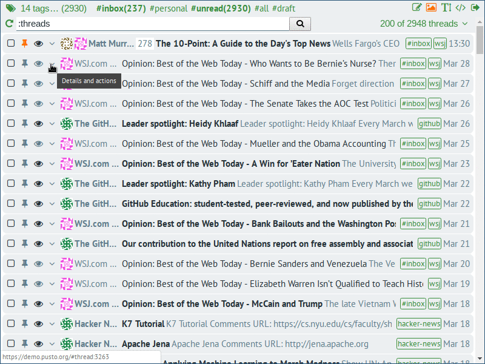
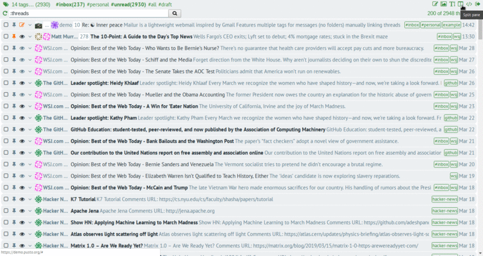
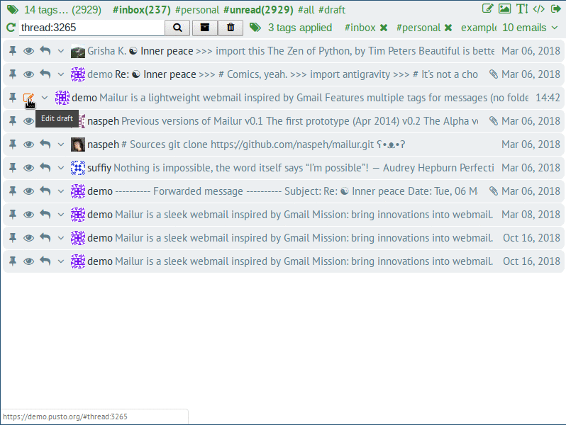
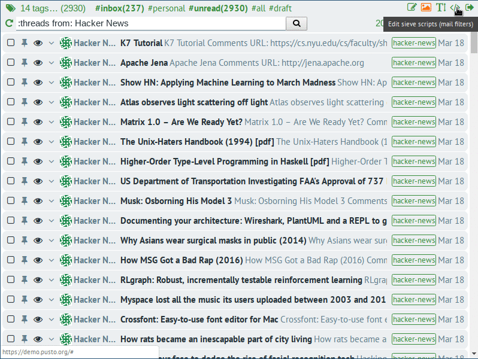

# Feature overview
Mailur aims to create useful unique features except general features like good search, conversation view, tags. Let's try to review them here.

<a href="#link-threads" id="link-threads" class="anchor">#</a>

## Manually linking threads
I fell in love with Gmail conversation view when first tried. Gmail has really great threads, but they have some limitation like
 - 100 messages in thread is maximum
 - not always messages with the same author and subject are combined in one thread

So I really wanted to bring Gmail like conversations into open source webmail, but I also wanted to bring a feature I've always missed in Gmail, a possibility to manually merge threads into one. This feature was initially implemented in [Alpha.][mlr-alpha] After intensive usage over two years I realized that it changed the way I organize emails. When new email arrives in Inbox, my first reaction: "Should I put this message in existing thread?" (if it isn't already a part of some thread). I can link all invoices from one service together, link all news from another service into one thread, link almost all messages from a person I talk rarely as one conversation, etc. When next time I need to find an email I'll find not only particular email, but the full thread with all related emails. There is also ability to search through particular thread, it's really useful when I have a huge thread and I want to find a particular message in it.

Sometimes I want to find particular email and I can easily switch from threads view to messages view I just need to remove `:threads` from search bar.

<a href="#the-split-pane" id="the-split-pane" class="anchor">#</a>

## Independent split pane
I use Vim and I always split a window vertically into two panes. I open related file for context in one pane when editing the code in another pane. I introduced two panes mode in [first prototype][mlr-intro], then removed it from [Alpha][mlr-alpha] and now I repaired two panes back again and I really love them. I can write my drafts in the split pane and in the meantime, I can search a thread for context in the main pane.

<a href="#markdown" id="markdown" class="anchor">#</a>

## Writing using Markdown
I love a lightweight markup language [Markdown.][markdown] There are many projects that [adding Markdown support for  Gmail and Thunderbird][markdown-here] with some limitations. Markdown is the first citizen in Mailur for composing emails. Also the main pane can be used as live preview when editing a draft in the split pane.

<a href="#sieve-scripts" id="sieve-scripts" class="anchor">#</a>

## Sieve scripts
Gmail has pretty good filters and they can be applied for old messages as well. In open source mail usually [Sieve language][sieve-rfc] is used for email filtering, but usually [it's hard to apply these Sieve scripts for existing emails.][sieve-refiter] As I use [Dovecot as storage,][mlr-dovecot] it has [IMAP FILTER=SIEVE][sieve-imap] extension, so Sieve scripts can be applied not only for new emails, but also they can be run for all existing emails from interface.

[mlr-intro]: /mailur/intro
[mlr-alpha]: /mailur/alpha
[mlr-dovecot]: /mailur/dovecot
[sieve-rfc]: https://tools.ietf.org/html/rfc5228
[sieve-imap]: https://wiki2.dovecot.org/Pigeonhole/Sieve/Plugins/IMAPFilterSieve
[sieve-refiter]: https://mebsd.com/configure-freebsd-servers/dovecot-pigeonhole-sieve-filter-refilter-delivered-email.html
[markdown]: https://daringfireball.net/projects/markdown/syntax
[markdown-here]: https://markdown-here.com/
