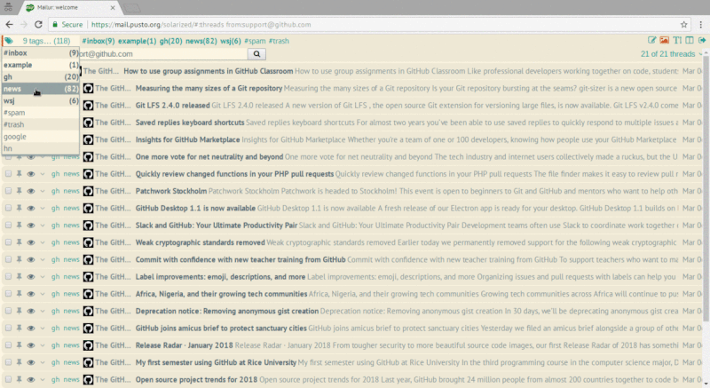

# Mailur is a lightweight webmail inspired by Gmail 

## Features
- multiple tags for messages (no folders)
- manually linking threads
- Sieve scripts for email filtering
- composing messages with [Markdown][]
- easy to switch from threads view to messages view
- independent split pane
- slim and compact interface with few basic themes
- ...

Brand-new version uses [Dovecot as main storage][mlr-dovecot], no database required.

This version is already in use. It has minimal feature set I need on daily basis. I have big plans for this project and I'm still working on it when I have spare time.

## Related links
- [public demo][demo] (credentials: demo/demo)
- [github page][gh]

[demo]: http://demo.pusto.org
[vimeo]: https://vimeo.com/259140545
[gh]: https://github.com/naspeh/mailur/
[mlr-dovecot]: /mailur/dovecot/
[Markdown]: https://daringfireball.net/projects/markdown/syntax
